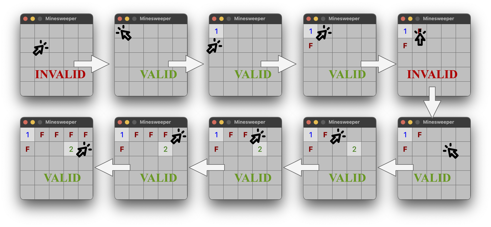

# Minesweeper-for-LLM Replication and Extension Study

This repository provides the code, data, and analysis tools for replicating and extending the study presented in: *Assessing Logical Puzzle Solving in Large Language Models: Insights from a Minesweeper Case Study* [[arXiv](https://arxiv.org/abs/2311.07387)].

Our work focuses on reproducing the original findings and evaluating the performance of more recent OpenAI models (GPT-4o, GPT-4.1 Mini, o3-mini, o4-mini) on this logical reasoning task.

<p float="left">
  
   
</p>
*Figure from original paper showing human vs. GPT-3.5-instruct gameplay.*

## 1. Setup and Requirements

### Environment

This project requires **Python 3.11**. It is highly recommended to use `conda` to manage dependencies.

1.  **Create Conda Environment:**
    ```bash
    conda create -n ms python=3.11
    ```
2.  **Activate Environment:**
    ```bash
    conda activate ms
    ```

### Dependencies

Install the required Python packages:

```bash
# Ensure your 'ms' environment is active
pip install -r requirements.txt
```

This includes the necessary libraries like `openai`, `numpy`, and `python-dotenv` (for API key management).

## 2. API Key Configuration (.env)

Instead of editing JSON files directly, API keys are now managed via a `.env` file for better security.

1.  **Create `.env` file:** In the root directory of this project (`Minesweeper-for-LLM/`), create a file named exactly `.env`.
2.  **Add API Key:** Add the following line to the `.env` file, replacing `sk-...` with your actual OpenAI API key:
    ```dotenv
    OPENAI_API_KEY=sk-...
    ```
3.  **Add to `.gitignore`:** Ensure the `.env` file is listed in your `.gitignore` file to prevent accidentally committing your key.

## 3. Running Experiments

The main script for running the gameplay simulation is `tasks/ms.py`. The older shell scripts in `./scripts/` might not reflect the current setup or all options.

### Core Configuration Arguments

When running `tasks/ms.py`, you need to specify several key configurations:

*   `--gpt_resource_path <path>`: **(Required)** Path to the model configuration JSON file in the `./resources/` directory. This determines which LLM model to use.
*   `--board_path_or_dir <path>`: Path to the input board file(s). Use `./data/5x5-4-labeled/` for the standard 5x5, 4-mine, 100-board dataset used in our study.
*   `--output_dir <path>`: **(Important!)** Specify a unique directory path where the results for this specific run will be saved. Use a clear naming convention, e.g., `./output/board-solve/5x5-4-<model_short_name>-<format>-<mode>/`.
*   `--represent_board_as_coordinate <true|false>`: Use `true` for Coordinate format (recommended based on original paper) or `false` for Table format.
*   `--use_compressed_history <true|false>`: Use `false` for Natural Conversation (NC) mode (recommended for newer models with large context windows) or `true` for Compact History (CH) mode.
*   `--max_steps <number>`: Maximum number of LLM turns per game (e.g., `10`).
*   `--strict_winning_condition <true|false>`: Use `true` for the strict win definition (all mines flagged, no non-mines flagged).

### Available Model Configurations (`./resources/`)

Configuration files are provided for:

*   `gpt-3.5-turbo.json`
*   `gpt4.json`
*   `gpt-4o.json`
*   `gpt-4.1-mini.json` (uses model ID `gpt-4.1-mini-2025-04-14`)
*   `o3-mini.json`
*   `o4-mini.json`

*(Note: `o1-mini` was excluded due to persistent API/prompt compatibility issues encountered during testing.)*

### Example Run Command

This example runs `gpt-4o` using Coordinate format and Natural Conversation mode on the standard 5x5 board set:

```bash
# Ensure 'ms' conda environment is active or use full python path
# Ensure .env file is created with your API key

PYTHONPATH="." python ./tasks/ms.py \
  --gpt_resource_path "./resources/gpt-4o.json" \
  --board_path_or_dir "./data/5x5-4-labeled/" \
  --output_dir "./output/board-solve/5x5-4-gpt4o-coord-nc/" \
  --max_steps 10 \
  --use_compressed_history false \
  --represent_board_as_coordinate true \
  --strict_winning_condition true
```

**Important:** Running experiments involves significant API calls and will incur costs. Runs processing 100 boards can take a substantial amount of time.

### Other Tasks (`bn.py`, `nc.py`)

The `./tasks/` directory also contains scripts for the Board Navigation (`bn.py`) and Neighbor Counting (`nc.py`) tasks from the original paper. These can be run similarly, using relevant arguments from `src/args.py`.

## 4. Analyzing Results

After running experiments, use the `analyze_results.py` script to calculate objective performance metrics.

### Usage

Run the script from the project root, providing the path to the specific output directory you want to analyze and the corresponding input board directory:

```bash
# Ensure 'ms' conda environment is active or use full python path
python analyze_results.py <path_to_output_dir> <path_to_input_dir>
```

**Example:**

```bash
python analyze_results.py ./output/board-solve/5x5-4-gpt4o-coord-nc/ ./data/5x5-4-labeled/
```

### Metrics Calculated

The script calculates and prints:

*   % Solved (Strict)
*   % Failed (Hit Mine)
*   % Valid Actions (Post-Initial)
*   % Repeated Actions (Post-Initial)
*   % Mines Flagged

Refer to `metrics.md` for detailed explanations of how each metric is calculated and its alignment with the original paper.

## 5. Locating Results

*   **Raw Experiment Outputs:** Individual game results (JSON logs including conversation, action history, final board state; plus TXT conversation logs) are saved within the `--output_dir` you specified when running `tasks/ms.py`.
*   **Consolidated Analysis:** A summary table comparing the results across different models (based on the runs analyzed with `analyze_results.py`) is available in `experiment_results_summary.md`.
*   **Detailed Report:** A report summarizing the implementation, testing process, results, and discussion can be found in `implementation_and_testing.md`.

## Playing Minesweeper on GUI

(Note: This functionality is from the original repository and may not reflect recent changes.)

Currently, we have not implemented a script for just playing Minesweeper with GUI.
But you can still do this by running the `./assist/label_board.py` script.
Specifically,
```bash
PYTHONPATH="." python ./assist/label_board.py --data_dir [your data dir] --disable_saving
```
You can either use our provided data or generate Minesweeper boards of your own through `./assist/generate_board.py`.

## Citation (Original Paper)

If you find the original work helpful, please consider citing it as:
```
@article{Li.2023.Minesweeper,
  author       = {Yinghao Li and
                  Haorui Wang and
                  Chao Zhang},
  title        = {Assessing Logical Puzzle Solving in Large Language Models: Insights
                  from a Minesweeper Case Study},
  journal      = {CoRR},
  volume       = {abs/2311.07387},
  year         = {2023},
  url          = {https://doi.org/10.48550/arXiv.2311.07387},
  doi          = {10.48550/ARXIV.2311.07387},
  eprinttype    = {arXiv},
  eprint       = {2311.07387},
  timestamp    = {Wed, 15 Nov 2023 16:23:10 +0100},
  biburl       = {https://dblp.org/rec/journals/corr/abs-2311-07387.bib},
  bibsource    = {dblp computer science bibliography, https://dblp.org}
}
```